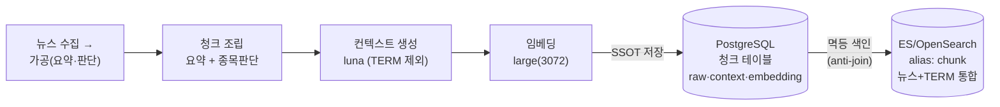
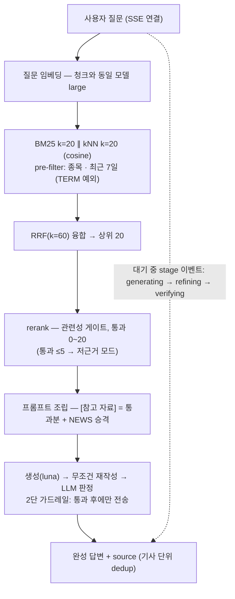

# CB-3-1. 아키텍처 (챗봇 RAG)

## CB-3-1.1 전체 그림 — 두 갈래에 걸친 파이프라인

**① 색인 파이프라인 (경로 B — 배치, 기존 임베딩 배치 확장)**

**② 질의 파이프라인 (경로 A — 실시간, SSE)**

- **색인은 배치, 검색·생성은 실시간** — 배치 5기능과 달리 사용자 지연이 직접 보이는 경로
- ES 는 검색 전용 — 저장의 진실은 PG (C-NFR2)

## CB-3-1.2 저장소 배치

| 저장소 | 보관 내용 | 비고 |
| --- | --- | --- |
| PG 신규 청크 테이블 | chunk_id, news_id(원천 참조), raw_text(원문 청크), context(맥락문), **embedding(보관 확정 — 9/19)**, 생성 시각 | 기존 운영 테이블 무변경. 임베딩을 PG 에도 보관 → **ES 유실·전량 재색인 시 재임베딩 비용 0** ("PG 에서 재색인으로 복구" 원칙 완성). 저장 이중화 비용은 코퍼스 규모상 미미 |
| ES 인덱스 | search_text(nori 합본 = context+raw+스니펫), embedding(dense_vector, cosine, dims 3072 — large 확정), raw_text, stock_codes(keyword — 노션 안에 보강), published_at(date), source_type(NEWS_SUMMARY/NEWS_STOCK/TERM — 뉴스·용어 한 인덱스 통합), _id=chunk_id | **alias(`chunk-v1`) 접근** — 무중단 재색인 전제 |
| 기존 knowledge_chunk | **신규 테이블 백필 완료 검증 후 DROP (확정 9/19)** — 임베딩을 신규 테이블에 보관하므로 존재 이유 없음. pgvector 폴백 검색도 **신규 테이블 기반**(HNSW 인덱스)으로 구현 → 구 테이블·구 임베딩 배치를 듀얼런 동안 살려둘 필요 없음 | 폴백 품질도 신규(3072·컨텍스트 합본) 기준이라 오히려 향상 |

## CB-3-1.3 정합성 (PG↔ES)

- 쓰기 순서 고정: **PG 커밋 → ES 색인** (한 트랜잭션에 안 묶음)
- 색인은 멱등 배치 스텝 — "PG 에 있는데 ES 에 없는 것" anti-join, 실패 건 다음 회차 재등장
- term 은 upsert 갱신 데이터 — 뜻 갱신 시 재컨텍스트/재임베딩/재색인 전파 경로 필요
- 드리프트 감시: PG 청크 수 vs ES 문서 수 비교 메트릭 (§CB-6)

## CB-3-1.4 포트·모듈 배치 (헥사고날)

| 책임 | 포트 (sttak-domain) | 구현 위치 | 비고 |
| --- | --- | --- | --- |
| 검색 (읽기, api) | 현행 검색 포트 시그니처 **유지** | sttak-external ES 어댑터 | 시그니처 유지 시 챗 Service·프롬프트 조립·SSE 무변경. **Spring AI VectorStore 로는 불가**(RRF 하이브리드가 추상화 밖) — ES 클라이언트 직접 |
| 색인 (쓰기, batch) | 색인 포트 신설 | sttak-external ES 어댑터 (검색과 분리) | |
| 컨텍스트 생성 | 배치 스텝 → luna | 임베딩 스텝에 선행 단계로 | 멱등: context IS NULL 대상 |
| 임베딩 | `EmbeddingPort` (Spring AI, ADR-034) | 기존 공용 어댑터 | large(3072) 확정 — 프로퍼티 변경만 (C-NFR4) |
| 스토어 스위치 | — | `sttak.rag.store=pgvector\|es` (확정) | 듀얼런 컷오버 한정 — 안정화 후 구 경로와 함께 제거 (C-NFR7) |

## CB-3-1.5 인프라 (요약 — 상세는 §CB-7)

관리형 OpenSearch(nori 내장) 권장 · VPC 내 + SG(앱 태스크만) · dev 먼저, prod 는 컷오버 직전 ·
**prod 노드 구성(단일+재색인 복구 vs 멀티AZ)은 비용 결정으로 팀 논의**
