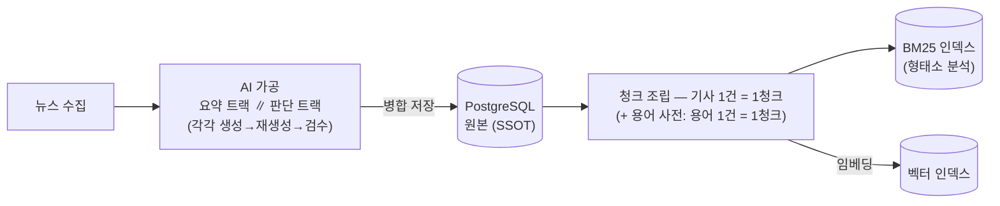
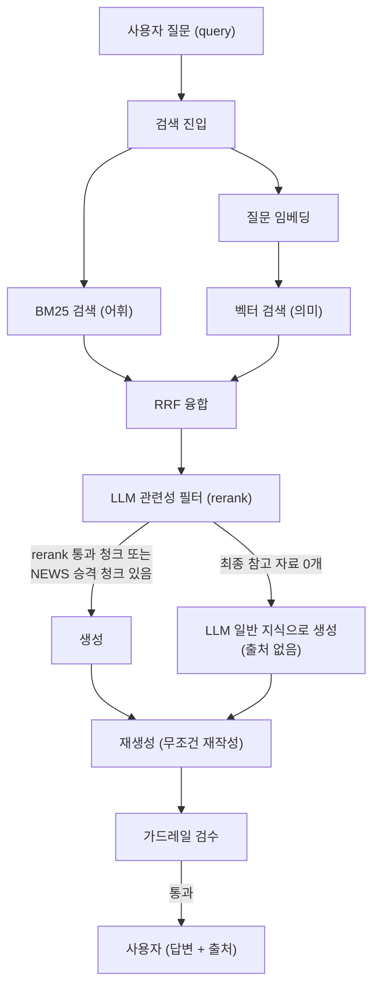

# CB-3-1. 아키텍처 (챗봇 + 뉴스 AI)

이 문서는 AI 파이프라인 설계만 다룬다. 서버 전체 구조는 `../3-1-server-architecture.md`,
모듈과 패키지 배치는 `../3-2-directory.md`를 참고한다. 통과·차단 기준을 포함한 실패 처리
방법은 `5-2-error-handling`, iOS와의 계약은 별도 계약 문서에서 설명한다.

## CB-3-1.1 설계 원칙

1. **검증 전 텍스트는 사용자에게 제공하지 않는다.** 모든 결과물은 재생성과 검수를 통과한
   뒤에만 뉴스로 저장하거나 챗봇 답변으로 전송한다.
2. **근거를 우선한다.** 챗봇은 검색한 자료를 바탕으로 답하고 출처를 함께 제공한다. 자료가
   부족하면 이를 답변에 밝히며, 없는 근거를 만들지 않는다.
3. **뉴스는 배치로 만들고 챗봇 답변은 실시간으로 생성한다.** 뉴스 가공과 색인은 배치(경로
   B)에서 미리 처리하고, 실시간 경로(경로 A)에서는 검색과 답변 생성만 수행한다. 피드는
   저장된 결과만 조회하므로 LLM을 호출하지 않는다.
4. **검색 인덱스는 원본 데이터로 만든 파생물이다.** 원본은 PostgreSQL에 보관하고, 인덱스는
   필요할 때 언제든 다시 만들 수 있어야 한다.

## CB-3-1.2 색인 파이프라인 (배치)

뉴스 가공 결과를 챗봇이 검색할 수 있는 형태로 만든다. 기사 한 건의 요약과 종목 판단을 합쳐
청크 하나로 만들고, 용어도 한 건을 청크 하나로 만든다. 청크를 더 작게 나누지 않는다. 각
청크가 충분히 짧으므로 별도의 맥락문(Contextual Retrieval)을 만들지 않고 그대로 색인한다.

- 요약과 판단은 독립 트랙(N-FR6)으로 처리한다. 각각 별도의 프롬프트로 생성, 재생성, 검수를
  마친 뒤 기사 단위로 합쳐 저장한다. 판단 라벨은 코드로 잠근다(N-FR7).
- 색인은 뉴스·용어 2원천(C-FR2)을 대상으로 하며, BM25 · 벡터 양쪽에 이중 색인한다.
- 뉴스 청크는 **기사 원문 URL을 메타데이터로 보관**한다. 검색부터 답변 생성까지
  `document`에 URL을 유지하며, 이 값을 사용해 최종 답변의 "참고한 기사" 목록을 만든다(`3-2`
  원칙 6).

## CB-3-1.3 질의 파이프라인 (실시간)

단계별 책임:

| 단계 | 하는 일 | 성격 |
| --- | --- | --- |
| BM25 ∥ 벡터 검색 | 어휘·의미 두 축으로 후보 청크 수집. 종목·기간 필터 공통 적용 | 검색 엔진 |
| RRF 융합 | 두 순위를 하나로 결합 | 수식 (LLM 아님) |
| rerank | 질문과 관련 없는 청크를 제거한다. 통과 개수는 달라질 수 있으며, 판단이 어려우면 통과시킨다 | LLM |
| 생성 | rerank 통과 청크와 NEWS 승격 청크로 [참고 자료]를 구성해 답변을 생성한다. 최종 참고 자료가 없으면 일반 지식으로 답한다 | LLM |
| 재생성 → 검수 | 배치 가공과 같은 검증 파이프라인을 거치며, 통과한 답변만 전송 | LLM + 코드 |

**검색 결과가 0건이어도 실패로 처리하지 않는다.** 한쪽 검색에만 결과가 있으면 RRF 융합을
생략하고 해당 결과를 그대로 rerank에 넘긴다. 양쪽 모두 결과가 없으면 RRF와 rerank를
생략한다. 이때 NEWS 승격 청크가 있으면 해당 청크를 참고 자료로 사용하고, 없으면 일반 지식
답변을 생성한다. 어느 단계에서도 결과가 없다는 이유로 오류를 반환하지 않는다(`4-2`, `5-2`).

## CB-3-1.4 기능별 AI 입출력

아래 표는 LLM을 호출하는 시점과 입출력을 정리한 것이다. 자세한 규격과 예시는 `3-2`를
참고한다.

| 호출 | 시점 | 입력 | 출력 |
| --- | --- | --- | --- |
| 뉴스 요약 | 배치 (가공) | 기사 제목+스니펫 | easyTitle / easyOneLiner / easyDetail / terms |
| 호재/악재 판단 | 배치 (가공) | 기사 + 종목 목록 | 종목별 sentiment / reason / whyPoints |
| 청크 임베딩 | 배치 (색인) | 청크 텍스트 | 벡터 |
| 질문 임베딩 | 질의마다 | 질문 텍스트 | 벡터 (청크와 동일 모델) |
| rerank | 질의마다 | 질문 + 후보 청크 | 청크별 관련/무관 판정 |
| 답변 생성 | 질의마다 | 시스템 프롬프트 + [참고 자료] + 히스토리 + 질문 | 답변 텍스트 |
| 재생성 | 생성마다 | 1차 생성물 + 형식 규칙 (+ 검수 피드백) | 재작성문 |
| 검수 | 재생성마다 | 재작성문 + 후보 탐지 힌트 | pass / 위반 목록(범주·인용) |
