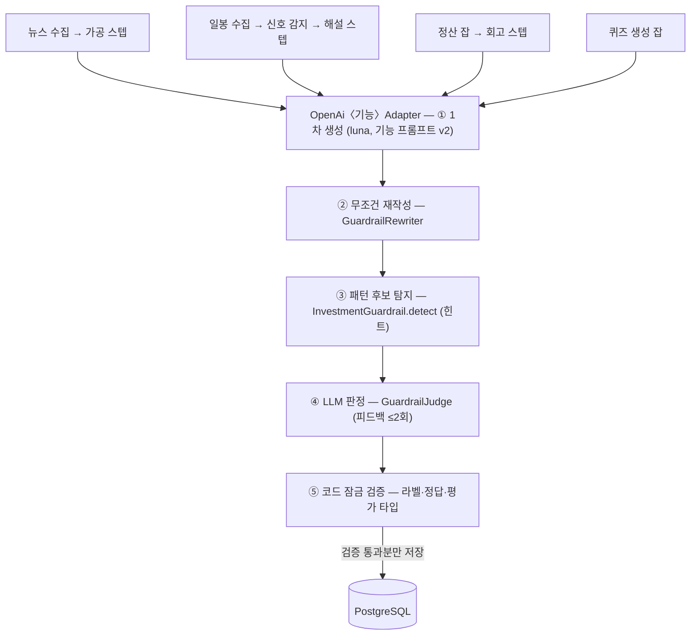
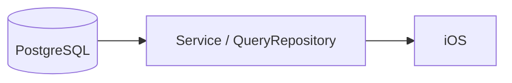
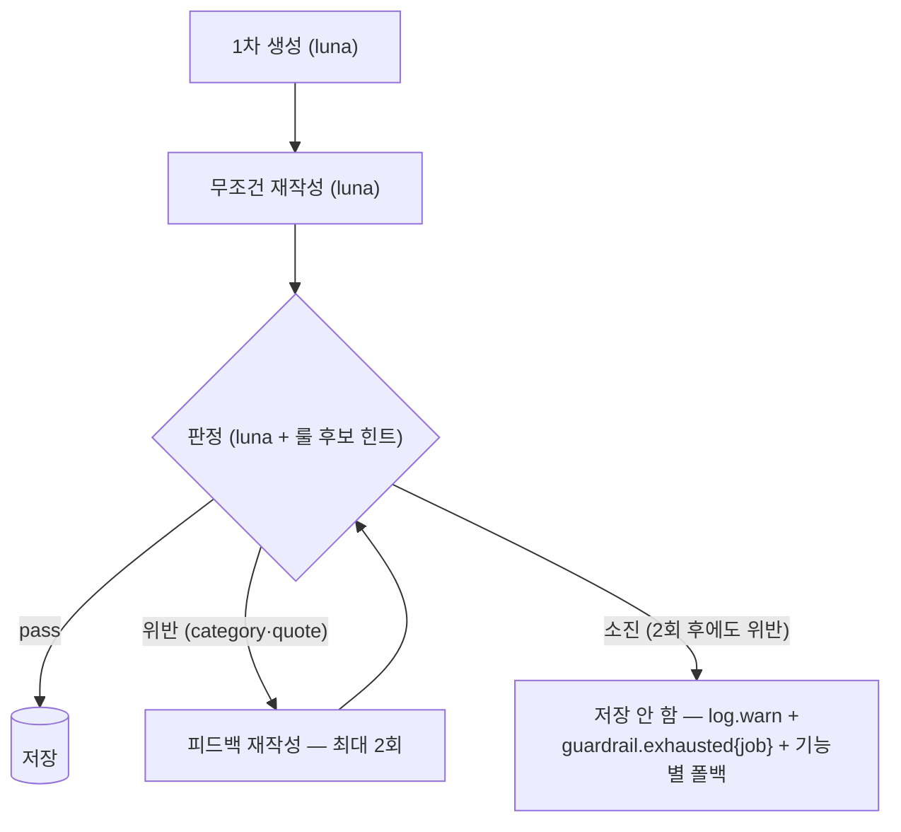

# AI-3-1. AI 기능 아키텍처

> 전체 서버 아키텍처는 `../3-1-server-architecture.md` (DDD + Hexagonal + CQRS, 두 갈래 구조).
> 여기서는 AI 기능 5종이 그 구조 안에서 어떻게 배치되는지와 가드레일 파이프라인의 위치를 정의한다.

## AI-3-1.1 전체 그림

**① 생성·검증 흐름 (경로 B — 배치)**

**② 조회 흐름 (경로 A — 실시간, LLM 0회)**

- 잡(Tasklet/Step)은 오케스트레이션만 한다 — 대상 선정(결과 없는 건만 골라내는 anti-join 조회)·상한(batch-size)·트랜잭션.
- 전송 계층은 **Spring AI ChatModel/EmbeddingModel**(ADR-033/034) — 공통 구성은
  `OpenAiChatModelSupport`(경로·타임아웃·ADR-014 재시도·Langfuse Observation). 요청 규격은
  `3-2 §AI-3-2.0` 이 계약. 챗 스트리밍만 RestClient 유지(전환 제외).
- 생성 지식(프롬프트·스키마·매핑·파이프라인 연결)은 전부 `sttak-external` 어댑터에 있다.
- 도메인은 Port 시그니처(도메인 타입)만 안다. 벤더 DTO 는 external 밖으로 새지 않는다(§3-2.5).

## AI-3-1.2 포트 ↔ 어댑터 매핑

| Port (sttak-domain) | 어댑터 (sttak-external) | 활성 조건 | 잡 |
| --- | --- | --- | --- |
| `NewsAnalysisPort` (요약+판단) | `OpenAiNewsAnalysisAdapter` | `sttak.ai.provider=openai` | 뉴스 가공 스텝 |
| `QuizGenerationPort` | `OpenAiQuizGenerationAdapter` | 〃 | 퀴즈 생성 잡 |
| `ChartSignalExplanationPort` | `OpenAiChartSignalExplanationAdapter` | 〃 | 일봉 수집 잡의 해설 스텝 |
| `TradeRetrospectivePort` | `OpenAiTradeRetrospectiveAdapter` | 〃 | 정산 잡의 회고 스텝 |
| (공용) `GuardrailRewriter` / `GuardrailJudge` | `OpenAiGuardrail{Rewrite,Judge}Adapter` | 〃 | — |

- **뉴스 요약·판단은 기능 2개 : 어댑터 1개 : 트랙 2개** — 어댑터 안에서 두 트랙이 각자
  생성(v2/v4 단독 프롬프트)→재작성→판정을 독립 수행 후 병합한다(AI-FR2b). 2차 평가가 이
  분리 구성으로 실측됐기 때문(검증-운영 정합). jobTag(news-summary/news-sentiment)로 트랙별
  메트릭도 분리된다. 모순 우려는 스모크 100건 교차 검수 0건으로 해소.
- 차트·회고 잡은 Port 를 `ObjectProvider` 로 받는다 — 구현 없는 provider 값이면 해당 스텝만
  비활성 스킵하고 부팅·수집·정산은 정상 동작한다.
- `AI_PROVIDER` 스위치는 유지하나 구현은 openai 뿐이다(ADR-032). 재분기 시 어댑터 추가 + ADR.

## AI-3-1.3 2단 가드레일 파이프라인 (ADR-032)

역할 분담과 그 근거 (전부 SCRUM-73 실측, 상세 수치는 ADR-032):

| 단계 | 담당 | 왜 이렇게 |
| --- | --- | --- |
| 재작성 | LLM, **무조건** | 걸린 것만 고치는 조건부 대비 잃는 것 없이(회귀 1.3%, 라벨 깨짐 0) 스타일 향상 확보. "그대로 출력" 조항도 제거(v3 실험) |
| 후보 탐지 | 룰 엔진 (`InvestmentGuardrail.detect`) | 결정적 보장 — 패턴에 걸린 표현은 반드시 LLM 이 검토. 종결형 매칭 + 예외 4규칙로 오탐 0/834 |
| 최종 판정 | LLM | 경계문 판별 룰 50% vs LLM 86%. 판정 불능(호출·파싱 실패)은 통과(가용성 우선), **refusal 은 반려**(입력 이상 신호) |
| 구조 보호 | 코드 (어댑터) | 라벨·정답·평가 타입은 LLM 에 맡기지 않는다 — 동등성 검증 실패 시 반려 (`AI-3-2.2`) |

## AI-3-1.4 데이터 소유와 멱등성

| 기능 | 저장 위치 | 멱등 키 | 재생성 정책 |
| --- | --- | --- | --- |
| 뉴스 요약·판단 | `news_analysis`(요약·terms) + `news_stock`(판단) (ADR-003) | 뉴스 상태머신 (COLLECTED→ENRICHED) — 트랙은 분리돼도 전이는 기사 단위 | 한 트랙이라도 실패 시 상태 유지 → 다음 회차 재시도 (retry_count, V8) |
| 퀴즈 | `quiz` (문항) + `quiz_vector` (유사도 임베딩, V18 — Spring AI VectorStore 전용 테이블) | 유사도 0.80 중복 차단 (`QuizSimilarityPort`) | 문항당 최대 3회 재시도 |
| 차트 해설 | `chart_signal_explanations` | `chart_signal_id UNIQUE` (V12) | 해설은 불변 — 실패 건만 anti-join 재등장 (ADR-025) |
| 회고 | `order_reviews` | 주문 UNIQUE | 실패 건만 anti-join 재등장 (ADR-024) |

파이프라인 도입으로 **저장 스키마는 아무것도 바뀌지 않았다** — 가드레일은 저장 전 단계에서만 동작한다.
