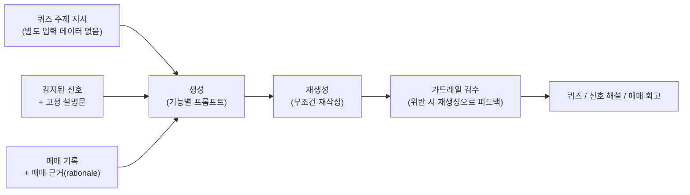

# AF-3-1. 아키텍처 (배치 AI 기능)

이 문서는 AI 파이프라인 설계만 다룬다. 서버 전체 구조는 `../3-1-server-architecture.md`,
모듈과 패키지 배치는 `../3-2-directory.md`를 참고한다. 통과·차단 기준을 포함한 실패 처리
방법은 `5-2-error-handling`에서 설명한다.

## AF-3-1.1 설계 원칙

1. **검증을 마치기 전에는 저장하지 않는다.** 모든 결과물은 재생성과 검수를 통과한 뒤에만
   저장한다. 재시도 횟수를 모두 소진하면 해당 결과를 버리고 다음 배치에서 다시 시도한다.
2. **생성은 배치에서 처리하고 조회는 저장된 값만 읽는다.** 신호 감지, 정산, 일 배치 등의
   이벤트마다 한 번 생성해 저장한다. 사용자 조회 경로에서는 LLM을 호출하지 않는다.
3. **AI가 맡을 범위를 분명히 나눈다.** 신호는 서버 규칙으로 감지하고 감지 조건은 사람이
   작성한 고정 설명문으로 제공한다. 정답과 평가 타입은 코드로 보호한다. AI는 설명문 작성만
   담당한다.
4. **한 건의 실패 때문에 전체 작업을 멈추지 않는다.** 실패한 건은 저장하지 않는다. 결과가
   없는 건은 다음 배치에서 다시 생성 대상으로 선택된다.

## AF-3-1.2 생성·검증 파이프라인 (공통)

세 기능은 입력 데이터만 다르고, 생성 → 재생성 → 가드레일 검수라는 같은 흐름을 따른다.
뉴스 가공 파이프라인(`../ai-chatbot/3-1`)도 같은 구조를 사용한다.

- 검수를 통과한 결과만 사용한다. 피드백 재생성 횟수를 모두 소진하면 해당 결과는 버리고,
  다음 배치에서 다시 시도한다.
- 검수 후에는 **코드 잠금 검증**으로 정답 번호와 평가 타입 순서가 유지됐는지 확인한다.
  퀴즈는 기존 문항과의 유사도도 비교하며, 의미가 겹치면 폐기하고 다시 생성한다.
- 검수와 재생성 방식(항상 재생성, 피드백 반복, fail-open/closed 기준)은 챗봇·뉴스 기능과
  같다. 기본 원리는 `../ai-chatbot/3-1`, 실패 처리 기준은 `5-2`를 참고한다.

## AF-3-1.3 기능별 AI 입출력

아래 표는 LLM을 호출하는 시점과 입출력을 정리한 것이다. 자세한 규격과 예시는 `2-2`의 각
기능 설명을 참고한다.

| 호출 | 시점 | 입력 | 출력 |
| --- | --- | --- | --- |
| 퀴즈 생성 | 일 배치 | 주제 범위 프롬프트 | 문항 + 선지 4 + 정답 + 해설 |
| 퀴즈 유사도 임베딩 | 문항 생성마다 | 문항 텍스트 | 벡터 (기존 문항과 비교) |
| 신호 해설 생성 | 신호 감지 후 | 신호 종류 + 종목 + 발생 시점 + 고정 설명문 | 해설 4~5문장 |
| 회고 생성 | 매도 정산 후 | 매매 정보 + rationale(주입 방어 처리) | summaryLine + goodPoints + watchPoints + evaluations |
| 재생성 | 생성마다 | 1차 생성물 + 형식 규칙 (+ 검수 피드백) | 재작성문 |
| 검수 | 재생성마다 | 재작성문 + 후보 탐지 힌트 | pass / 위반 목록(범주·인용) |
